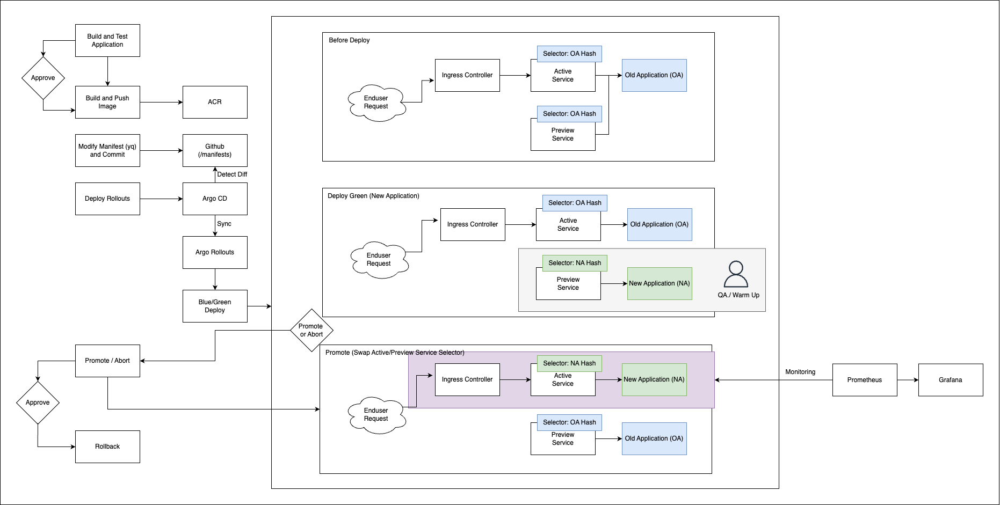

# FastAPI Sample API Server

## Environments
- Azure
  - Azure Kubernetes Service 1.28.13
  - Kubernetes Addons: Ingress NGINX Controller, ArgoCD, Argo Rollouts
  - Azure Container Registry
- Github Repository
  - Application Source Code & Kubernetes Manifest
  - Github Actions Pipeline (CI)
- Slack for Notification
- Python > 3.11.x
- FastAPI > 0.115.0
- VSCode

## CI Step (Github Actions)

> File: [docker-image.yml](.github/workflows/docker-image.yml)

### Job 01
1. Checkout repo
2. Setup Python
3. Setup pip cache (actions/cache@v3)
4. Install Dependencies and PyTest Application
5. Upload Pytest Results as Github Actions Artifacts
6. Post to a Slack channel
7. Approve / Deny (environment)

### Job 02
1. Checkout repo
2. Setup Docker Buildx
3. Login to ACR
4. Build and Push Container Image to ACR (docker/build-push-action@v6.9.0) (registry type 빌드 캐시 사용)
5. Modify Rollout Manifest by yq
6. Post to a Slack channel

## CD Step (GitOps) - Argo CD & Argo Rollouts
1. Detect manifest change by Argo CD
2. Auto Sync by Argo CD
3. Blue / Green Deploy by Argo Rollouts
4. Promote or Abort (Manually)
5. Swap Active / Preview Service's Selector Hash
6. Monitoring and rollback or not

## FastAPI Sample Application
> Directory: [/app](/app)

- [main.py](app/main.py): 샘플 GET / POST / PUT / DELETE 구현

- [test_rest.py](app/test_rest.py): 빌드 전 pytest를 위한 샘플 테스트 코드

## Containerizing

> [Dockerfile](Dockerfile)

## Kubernetes Manifests
> Directory: [kubernetes](/manifests/)

> [Ingress NGINX Controller Installation](https://github.com/hyukjuns/kubernetes/tree/main/addons/ingress-nginx-controller)

> [rollouts.yaml](/manifests/rollouts.yaml)

> [ingress.yaml](manifests/ingress.yaml)

## Reference
- [Docker Non Root User](https://www.docker.com/blog/understanding-the-docker-user-instruction/)
- [yq](https://mikefarah.gitbook.io/yq)
- [FastAPI Docs](https://fastapi.tiangolo.com/)
- [FastAPI Source Code](https://github.com/fastapi/fastapi)
- [virtual-environments](https://fastapi.tiangolo.com/virtual-environments/#install-packages-directly)
- [FastAPI in Production](https://dev.to/dpills/fastapi-production-setup-guide-1hhh#setup)
- [Gunicorn을 Uvicorn의 프로세스 매니저로 더이상 사용하지 않아도 되는 이유](https://fastapi.tiangolo.com/deployment/docker/#single-container)
    
    Uvicorn에 서브 프로세스 들을 생성하고 관리할 수 있는 기능이 추가되었음 (다운된 프로세스 재시작 등)
- [Uvicorn Setting](https://www.uvicorn.org/settings/)
- [One process per Container](https://fastapi.tiangolo.com/deployment/docker/#one-process-per-container)
    
    Containerized 해서 k8s에 배포할 경우 Uvicorn의 Worker 프로세스를 여러개 만들기 보다 컨테이너당 1개의 프로세스로 구동하고 Deployment의 Replias 개수를 증설하는 것도 방법 중 하나
- [Github Action-Python Build](https://docs.github.com/en/actions/use-cases-and-examples/building-and-testing/building-and-testing-python)
- [best-practices-for-rest-api-design](https://stackoverflow.blog/2020/03/02/best-practices-for-rest-api-design/)
- [\[Python\] Class의 연산자, 특수 메서드, 상속, 그리고 pydantic](https://devocean.sk.com/blog/techBoardDetail.do?ID=164774)
- [Uvicorn Logging](https://gist.github.com/liviaerxin/d320e33cbcddcc5df76dd92948e5be3b)