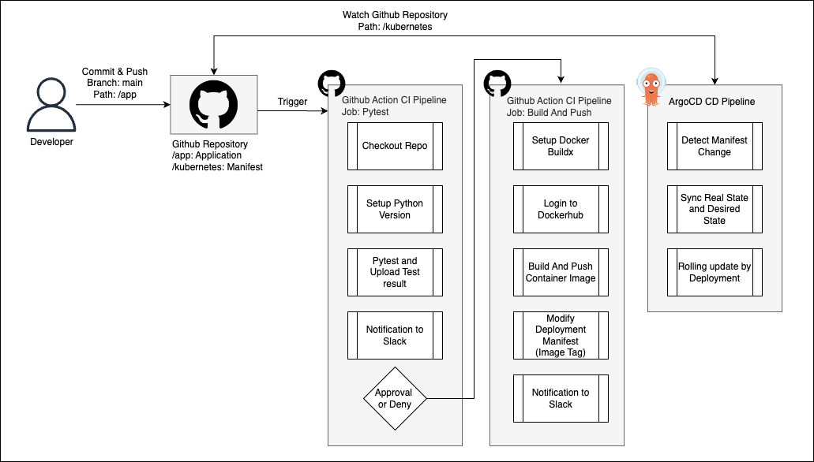
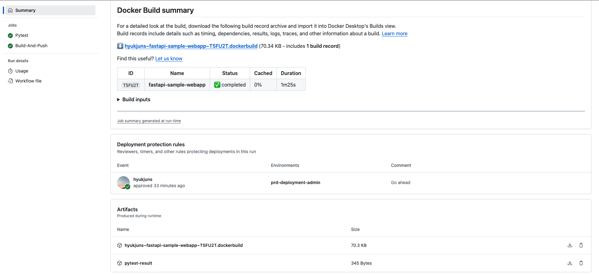
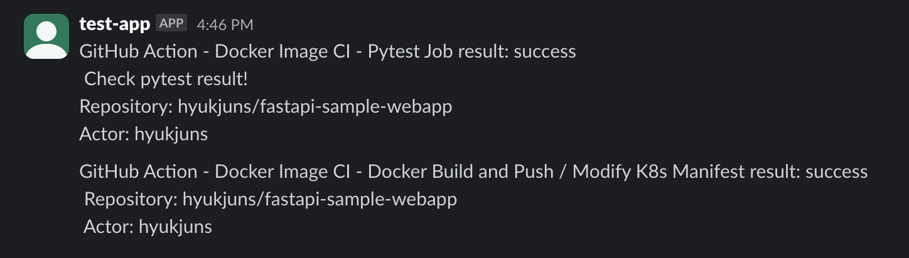
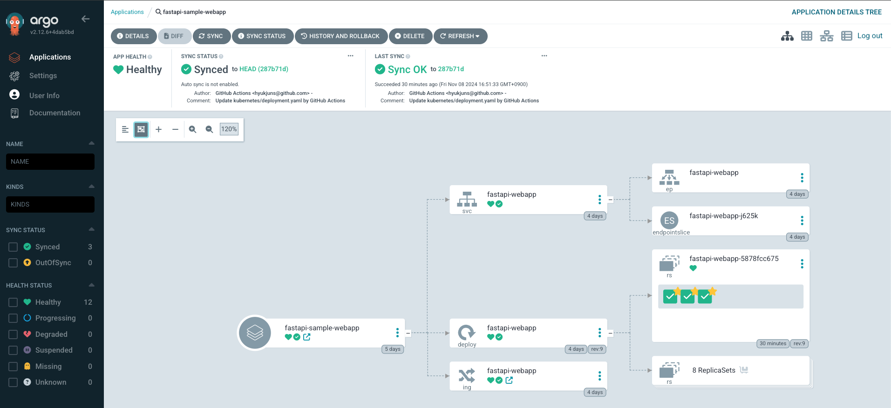
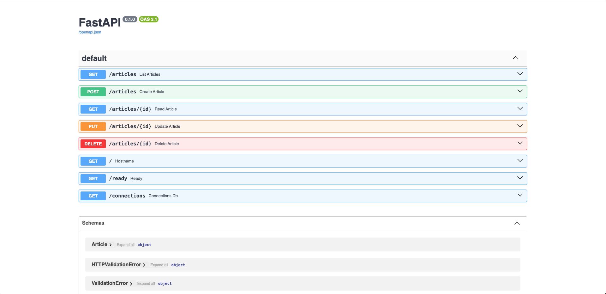

# FastAPI Sample API Server

## CI Step
### Job 01
1. Checkout repo
2. Setup Python
3. Setup pip cache (actions/cache@v3)
4. Install Dependencies and PyTest Application
5. Upload Pytest Results as Github Actions Artifacts
6. Post to a Slack channel
7. Approve / Deny (environment)

### Job 02
1. Checkout repo
2. Setup Docker Buildx
3. Login to ACR
4. Build and Push Container Image to ACR (docker/build-push-action@v6.9.0) (registry type 빌드 캐시 사용)
5. Modify Rollout Manifest by yq
6. Post to a Slack channel

## CD Step (GitOps)
### Argo CD & Argo Rollouts
1. Detect manifest change by Argo CD
2. Auto Sync by Argo CD
3. Blue / Green Deploy by Argo Rollouts
4. Promote or Abort (Manually)
5. Swap Active / Preview Service's Selector Hash
6. Monitoring and rollback or not

### Environments
- Azure
  - Azure VM (Self hosted Runner)
  - Azure Kubernetes Service 1.28.13
  - AKS Addons - Ingress NGINX Controller, ArgoCD
  - Azure Container Registry
- Github Repository
  - Application Source Code & Kubernetes Manifest
  - Github Actions Pipeline (CI)
- Slack
  - For Notification

### CI/CD Pipeline

> File: [docker-image.yml](.github/workflows/docker-image.yml)



#### CI: Github Actions

1. Job: Pytest

    1. Commit & Merge
    2. Pytest
    3. Notification to Slack
    4. Approval or Deny

2. Job: Buuld and Push

    1. Build & Push Docker Image
    2. Delivery to Container Registry
    3. Modify Deployment Manifest (Image Tag)
    4. Notification to Slack

- Snapshot
  - Github Action Build Summary
    
  
  - Slack Notification
    

#### CD: ArgoCD

1. Detect Deployment Manifest (Image Tag)
2. Sync Deployment (Rolling Update)

- Snapshot - ArgoCD
    

### FastAPI Sample Application
> Directory: [/app](/app)

#### Development Environment
- Python > 3.11.x
- FastAPI > 0.115.0
- VSCode

#### Sample CRUD REST API Application

- [main.py](app/main.py): 데모용 GET / POST / PUT / DELETE 구현

- [test_rest.py](app/test_rest.py): 빌드 스테이지의 pytest를 위한 샘플 테스트 코드 구현
- API Docs: Fastapi에 의해 자동 생성되는 Swagger Docs

  

### Containerizing

> File: [Dockerfile](Dockerfile)

```Dockerfile
FROM python:3.11-slim

# Container User
# -m: create home -s: login shell, Group is auto created
RUN useradd -ms /bin/bash -u 1001 python

# Setting Home
USER 1001
WORKDIR /home/python

# Package
COPY requirements.txt /home/python
RUN pip install -r requirements.txt

# Application File
COPY app/main.py /home/python

# Setting PATH
ENV PATH="/home/python/.local/bin:$PATH"

# Port
EXPOSE 8080

# Worker Count = 1, run by uvicorn
CMD ["fastapi", "run", "main.py", "--port", "8080"]
```
> Build Container by buildx: AKS 노드의 Arhitecture에 맞춰 amd64로 빌드
```markdown
# AMD64
docker build --platform linux/amd64 --no-cache -t hyukjun/fastapi-sample-webapp:v0.0.1 .
```

### Kubernetes
> Directory: [kubernetes](/kubernetes/)

- Deployment Manifest Specify
    - Application 부트스트랩 대기를 위한 startupProbe
    - Application 오류시 재시작을 위한 livenessProbe
    - Application 서빙 불가 시 readinessProbe를 통한 라우팅 제외
    - securityContext.runAsNonRoot 로 비루트 사용자 실행 보장
    - securityContext.readOnlyRootFilesystem 로 호스트 파일시스템에 쓰기 행위 방지
    - rollingUpdate 기본 배포 방식 채택
    - resources.limits와 requests를 동일하게 하여 QoS를 Gueranteed로 세팅함, 즉, 노드 자원 부족시 Evicted 처리가 쉽게 되지 않도록 우선순위를 높게 설정

> [deployment.yaml](/kubernetes/deployment.yaml)
```yaml
apiVersion: apps/v1
kind: Deployment
metadata:
  name: fastapi-webapp
spec:
  replicas: 3
  strategy:
    rollingUpdate:
      maxSurge: 25%
      maxUnavailable: 25%
  selector:
    matchLabels:
      app: fastapi-webapp
  template:
    metadata:
      labels:
        app: fastapi-webapp
    spec:
      containers:
        - name: fastapi-webapp
          image: hyukjun/fastapi-sample-webapp:<github-sha>
          resources:
            limits:
              cpu: 200m
              memory: 256Mi
            requests:
              cpu: 200m
              memory: 256Mi
          ports:
            - name: http
              containerPort: 8080
          # For Security
          securityContext:
            runAsNonRoot: true
            readOnlyRootFilesystem: true
          # Check Availability
          startupProbe:
            httpGet:
              path: /connections
              port: 8080
            initialDelaySeconds: 5
            periodSeconds: 5
            timeoutSeconds: 5
            failureThreshold: 3
          livenessProbe:
            httpGet:
              path: /
              port: 8080
            initialDelaySeconds: 5
            periodSeconds: 5
            timeoutSeconds: 5
            failureThreshold: 3
          readinessProbe:
            httpGet:
              path: /ready
              port: 8080
            initialDelaySeconds: 5
            periodSeconds: 5
            timeoutSeconds: 5
            failureThreshold: 3
```

#### Ingress by Ingress Nginx Controller

> [인그레스 컨트롤러 설치 관련 개인 저장소](https://github.com/hyukjuns/kubernetes/tree/main/addons/ingress-nginx-controller)

> [ingress.yaml](kubernetes/ingress.yaml)

```yaml
apiVersion: networking.k8s.io/v1
kind: Ingress
metadata:
  name: fastapi-webapp
  labels:
    name: fastapi-webapp
spec:
  ingressClassName: ingress-nginx-class
  rules:
  - host: fastapi.namutest.site
    http:
      paths:
      - pathType: Prefix
        path: "/"
        backend:
          service:
            name: fastapi-webapp
            port: 
              number: 80
---
apiVersion: v1
kind: Service
metadata:
  name: fastapi-webapp
spec:
  selector:
    app: fastapi-webapp
  type: ClusterIP
  ports:
  - port: 80
    targetPort: http

```

### Reference
- [Docker Non Root User](https://www.docker.com/blog/understanding-the-docker-user-instruction/)
- [yq](https://mikefarah.gitbook.io/yq)
- [FastAPI Docs](https://fastapi.tiangolo.com/)
- [FastAPI Source Code](https://github.com/fastapi/fastapi)
- [virtual-environments](https://fastapi.tiangolo.com/virtual-environments/#install-packages-directly)
- [FastAPI in Production](https://dev.to/dpills/fastapi-production-setup-guide-1hhh#setup)
- [Gunicorn을 Uvicorn의 프로세스 매니저로 더이상 사용하지 않아도 되는 이유](https://fastapi.tiangolo.com/deployment/docker/#single-container)
    - Uvicorn에 서브 프로세스 들을 생성하고 관리할 수 있는 기능이 추가되었음 (다운된 프로세스 재시작 등)
- [Uvicorn Setting](https://www.uvicorn.org/settings/)
- [One process per Container](https://fastapi.tiangolo.com/deployment/docker/#one-process-per-container)
    - Containerized 해서 k8s에 배포할 경우 Uvicorn의 Worker 프로세스를 여러개 만들기 보다 컨테이너당 1개의 프로세스로 구동하고 Deployment의 Replias 개수를 증설하는 것도 방법 중 하나
- [Github Action-Python Build](https://docs.github.com/en/actions/use-cases-and-examples/building-and-testing/building-and-testing-python)
- [best-practices-for-rest-api-design](https://stackoverflow.blog/2020/03/02/best-practices-for-rest-api-design/)
- [\[Python\] Class의 연산자, 특수 메서드, 상속, 그리고 pydantic](https://devocean.sk.com/blog/techBoardDetail.do?ID=164774)
- [Uvicorn Logging](https://gist.github.com/liviaerxin/d320e33cbcddcc5df76dd92948e5be3b)